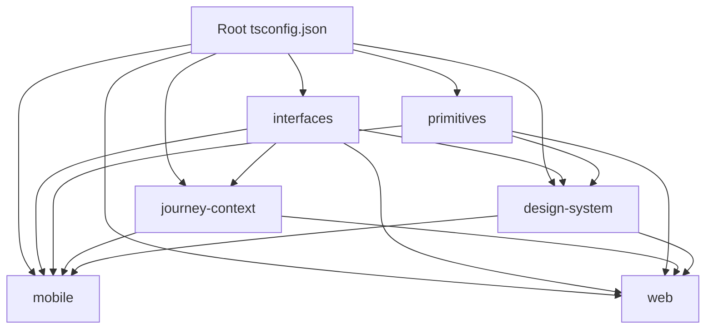

# AUSTA SuperApp Dependency Management Guide

## Table of Contents

1. [Introduction](#introduction)
2. [Monorepo Structure](#monorepo-structure)
3. [Version Resolution Strategy](#version-resolution-strategy)
4. [React Native Ecosystem Management](#react-native-ecosystem-management)
5. [Babel Configuration](#babel-configuration)
6. [TypeScript Configuration](#typescript-configuration)
7. [Dependency Caching and Build Optimization](#dependency-caching-and-build-optimization)
8. [Common Issues and Troubleshooting](#common-issues-and-troubleshooting)
9. [Best Practices](#best-practices)
10. [References](#references)

## Introduction

This document provides a comprehensive guide to dependency management in the AUSTA SuperApp monorepo. Proper dependency management is critical for maintaining build stability, preventing runtime errors, and ensuring consistent behavior across all services and applications.

The AUSTA SuperApp uses a complex monorepo structure with multiple workspaces, shared packages, and cross-platform components. This architecture requires careful management of dependencies to prevent version conflicts, ensure proper module resolution, and maintain build performance.

### Key Challenges

- **Version conflicts** between direct and transitive dependencies
- **Missing dependencies** required by mobile app and other services
- **Path resolution failures** causing build errors
- **React Native ecosystem** compatibility issues
- **Babel configuration** inconsistencies
- **Build performance** in a large monorepo

## Monorepo Structure

The AUSTA SuperApp uses a multi-workspace monorepo structure with two primary sections:

### Backend Monorepo (`/src/backend/`)

Managed by Lerna with the following key components:

- **API Gateway**: Entry point for all client requests
- **Journey Services**: Health, Care, and Plan services
- **Shared Services**: Auth, Gamification, and Notification services
- **Internal Packages**: Shared utilities and libraries

### Frontend Monorepo (`/src/web/`)

Managed by Turborepo with the following key components:

- **Web Application**: Next.js web client
- **Mobile Application**: React Native mobile client
- **Design System**: Shared UI components
- **Primitives**: Design tokens and basic components
- **Interfaces**: Shared TypeScript interfaces
- **Journey Context**: Journey-specific state management

### Workspace Configuration

#### Root `package.json`

The root `package.json` file defines workspaces and shared development dependencies:

```json
{
  "name": "austa-superapp",
  "private": true,
  "workspaces": [
    "src/web/*",
    "src/backend/*",
    "src/backend/packages/*"
  ],
  "resolutions": {
    "minimatch": "^5.1.6",
    "semver": "^7.5.4",
    "ws": "^8.14.2",
    "@babel/plugin-proposal-private-property-in-object": "^7.21.11",
    "@babel/plugin-proposal-class-properties": "^7.18.6",
    "@babel/plugin-proposal-object-rest-spread": "^7.20.7"
  },
  "devDependencies": {
    "typescript": "5.3.3",
    "eslint": "8.57.0",
    "prettier": "3.2.5",
    "husky": "^8.0.3"
  },
  "engines": {
    "node": ">=18.0.0",
    "pnpm": ">=8.0.0"
  }
}
```

#### Backend Workspace Configuration

The backend workspace is managed by Lerna with the following configuration in `lerna.json`:

```json
{
  "version": "independent",
  "npmClient": "pnpm",
  "useWorkspaces": true,
  "packages": [
    "src/backend/*",
    "src/backend/packages/*"
  ],
  "command": {
    "publish": {
      "conventionalCommits": true,
      "message": "chore(release): publish"
    }
  }
}
```

#### Frontend Workspace Configuration

The frontend workspace is managed by Turborepo with the following configuration in `turbo.json`:

```json
{
  "$schema": "https://turbo.build/schema.json",
  "pipeline": {
    "build": {
      "dependsOn": ["^build"],
      "outputs": ["dist/**", ".next/**", "build/**"]
    },
    "test": {
      "dependsOn": ["^build"],
      "outputs": []
    },
    "lint": {
      "outputs": []
    },
    "dev": {
      "cache": false
    }
  }
}
```

## Version Resolution Strategy

To maintain a consistent and error-free dependency tree, the AUSTA SuperApp implements a comprehensive version resolution strategy.

### Core Package Resolutions

The following core packages have known version conflicts and are explicitly resolved in the root `package.json`:

| Package | Resolved Version | Issue Addressed |
|---------|-----------------|------------------|
| minimatch | ^5.1.6 | Security vulnerability in older versions, conflicts between Jest and other packages |
| semver | ^7.5.4 | Version conflicts between React Native dependencies and NestJS |
| ws | ^8.14.2 | WebSocket implementation used by multiple packages with conflicting requirements |

### React Native Dependencies

React Native dependencies are pinned to specific versions to ensure compatibility:

| Package | Version | Notes |
|---------|---------|-------|
| react-native | 0.73.4 | Core React Native package |
| react-native-reanimated | 3.3.0 | Animation library |
| react-native-gesture-handler | 2.12.0 | Gesture handling |
| react-native-svg | 13.10.0 | SVG support |

### Babel Dependencies

Babel plugins are updated to use the newer transform plugins instead of deprecated proposal plugins:

| Deprecated Plugin | Replacement |
|------------------|-------------|
| @babel/plugin-proposal-private-property-in-object | @babel/plugin-transform-private-property-in-object |
| @babel/plugin-proposal-class-properties | @babel/plugin-transform-class-properties |
| @babel/plugin-proposal-object-rest-spread | @babel/plugin-transform-object-rest-spread |

### Dependency Resolution Process

The dependency resolution process follows these steps:

1. **Analyze Dependency Tree**: Use `pnpm why <package>` to identify all instances of a package and their required versions
2. **Identify Conflicts**: Look for packages with multiple version requirements
3. **Determine Compatible Version**: Find the newest version that satisfies all requirements
4. **Add Resolution**: Add the package to the `resolutions` field in the root `package.json`
5. **Validate Resolution**: Run `pnpm install` and verify that the correct version is installed

## React Native Ecosystem Management

The React Native ecosystem presents unique challenges due to its rapid evolution and complex dependency requirements. This section provides detailed guidance on managing React Native dependencies in the AUSTA SuperApp monorepo.

### Core React Native Configuration

The mobile application uses React Native 0.73.4 with the following configuration in `src/web/mobile/package.json`:

```json
{
  "name": "@austa/mobile",
  "version": "1.0.0",
  "dependencies": {
    "react": "18.2.0",
    "react-native": "0.73.4",
    "@austa/design-system": "1.0.0",
    "@design-system/primitives": "1.0.0",
    "@austa/interfaces": "1.0.0",
    "@austa/journey-context": "1.0.0"
  }
}
```

### Critical React Native Dependencies

The following React Native dependencies are critical for the AUSTA SuperApp and must be maintained at compatible versions:

| Package | Version | Purpose | Compatibility Notes |
|---------|---------|---------|--------------------|
| react-native | 0.73.4 | Core framework | Requires React 18.2.0 |
| react-native-reanimated | 3.3.0 | Advanced animations | Requires specific Babel plugin |
| react-native-gesture-handler | 2.12.0 | Gesture recognition | Must be imported before other UI components |
| react-native-svg | 13.10.0 | SVG support | Requires specific Metro transformer |
| react-native-screens | 3.27.0 | Navigation optimization | Must be initialized in app entry point |
| react-native-safe-area-context | 4.8.2 | Safe area handling | Required for proper insets on modern devices |
| @react-navigation/native | 6.1.9 | Navigation core | Foundation for all navigation in the app |
| @react-navigation/stack | 6.3.20 | Stack navigation | Used for journey-specific navigation flows |
| @react-navigation/bottom-tabs | 6.5.11 | Tab navigation | Used for main app navigation |

### Dependency Compatibility Matrix

The following matrix shows compatibility between key React Native packages:

| React Native Version | React Version | Navigation | Reanimated | Gesture Handler |
|----------------------|---------------|------------|------------|----------------|
| 0.73.x | 18.2.0 | 6.x | 3.x | 2.12.x |
| 0.72.x | 18.2.0 | 6.x | 3.x | 2.12.x |
| 0.71.x | 18.2.0 | 6.x | 2.x | 2.9.x |
| 0.70.x | 18.1.0 | 6.x | 2.x | 2.8.x |

### Native Module Dependencies

Native modules require special attention to ensure compatibility:

1. **Expo Compatibility**: When using Expo, ensure all native modules are compatible with the Expo SDK version
   - Use the [Expo compatibility table](https://docs.expo.dev/versions/latest/)
   - Consider using Expo config plugins for native modules
   - Use EAS Build for custom native code when needed

2. **Linking**: For non-Expo projects, ensure native modules are properly linked
   - Use autolinking for React Native 0.60+ (`npx pod-install` for iOS)
   - Manual linking may be required for some legacy modules
   - Check native module documentation for specific requirements

3. **Version Compatibility**: Check the React Native compatibility table for each native module
   - Review GitHub releases and compatibility notes
   - Test thoroughly after updating native modules
   - Consider freezing native module versions during critical development phases

### Handling Deprecated React Native APIs

As React Native evolves, APIs are deprecated and replaced. Here's how to handle common deprecations:

| Deprecated API | Replacement | Migration Strategy |
|----------------|-------------|--------------------|
| ListView | FlatList | Replace with FlatList and use keyExtractor |
| createStackNavigator (v4) | createStackNavigator (v6) | Migrate to React Navigation v6 patterns |
| componentWillMount | componentDidMount or useEffect | Use lifecycle alternatives or hooks |
| Clipboard (direct import) | @react-native-clipboard/clipboard | Install separate package |
| NetInfo (direct import) | @react-native-community/netinfo | Install separate package |

### Common React Native Issues

#### Metro Bundler Configuration

The Metro bundler requires proper configuration to resolve dependencies in a monorepo:

```js
// metro.config.js
const { getDefaultConfig } = require('metro-config');
const path = require('path');
const exclusionList = require('metro-config/src/defaults/exclusionList');

module.exports = (async () => {
  const {
    resolver: { sourceExts, assetExts },
  } = await getDefaultConfig();

  return {
    transformer: {
      babelTransformerPath: require.resolve('react-native-svg-transformer'),
      getTransformOptions: async () => ({
        transform: {
          experimentalImportSupport: false,
          inlineRequires: true,
        },
      }),
    },
    resolver: {
      assetExts: assetExts.filter(ext => ext !== 'svg'),
      sourceExts: [...sourceExts, 'svg'],
      extraNodeModules: new Proxy({}, {
        get: (target, name) => {
          return path.join(process.cwd(), `node_modules/${name}`);
        },
      }),
      resolverMainFields: ['react-native', 'browser', 'main'],
      // Prevent duplicate packages by excluding node_modules from workspaces
      blacklistRE: exclusionList([
        /\.yarn\/.*/,
        /.*\/web\/node_modules\/.*/, // Exclude web node_modules
        // Add other exclusions as needed
      ]),
    },
    watchFolders: [
      path.resolve(__dirname, '../../'), // Root of monorepo
      path.resolve(__dirname, '../../design-system/src'),
      path.resolve(__dirname, '../../primitives/src'),
      path.resolve(__dirname, '../../interfaces'),
      path.resolve(__dirname, '../../journey-context/src'),
    ],
    // Enable Hermes engine for better performance
    server: {
      enhanceMiddleware: (middleware) => {
        return (req, res, next) => {
          // Add custom middleware if needed
          return middleware(req, res, next);
        };
      },
    },
  };
})();
```

#### React Native Web Compatibility

For components that need to work in both React Native and React Native Web, use platform-specific extensions:

```
Button.tsx       # Shared code (platform-agnostic logic)
Button.native.tsx # React Native specific implementation
Button.web.tsx    # Web specific implementation
```

Implement a consistent pattern for platform detection:

```typescript
// src/utils/platform.ts
import { Platform } from 'react-native';

export const isWeb = Platform.OS === 'web';
export const isIOS = Platform.OS === 'ios';
export const isAndroid = Platform.OS === 'android';

export const platformSelect = Platform.select;
```

### React Native Performance Optimization

Optimize React Native performance with these strategies:

1. **Enable Hermes Engine**
   ```json
   // android/app/build.gradle
   project.ext.react = [
     enableHermes: true
   ]
   
   // ios/Podfile
   use_react_native!(
     :path => config[:reactNativePath],
     :hermes_enabled => true
   )
   ```

2. **Optimize Bundle Size**
   - Use ProGuard rules for Android release builds
   - Enable bitcode for iOS builds
   - Implement code splitting where possible

3. **Implement Fast Refresh Correctly**
   - Avoid non-serializable values in component state
   - Use `React.useCallback` and `React.useMemo` for expensive operations
   - Keep component state minimal and focused

### React Native Testing Configuration

Configure Jest for testing React Native components:

```js
// jest.config.js
module.exports = {
  preset: 'react-native',
  moduleFileExtensions: ['ts', 'tsx', 'js', 'jsx', 'json', 'node'],
  transformIgnorePatterns: [
    'node_modules/(?!(react-native|@react-native|react-native-.*|@react-navigation/.*|@austa/.*|@design-system/.*))',
  ],
  setupFiles: ['./jest.setup.js'],
  moduleNameMapper: {
    '^@app/(.*)$': '<rootDir>/src/$1',
    '^@austa/design-system$': '<rootDir>/../../design-system/src',
    '^@design-system/primitives$': '<rootDir>/../../primitives/src',
    '^@austa/interfaces$': '<rootDir>/../../interfaces',
    '^@austa/journey-context$': '<rootDir>/../../journey-context/src',
  },
};
```

## Babel Configuration

Babel configuration is critical for proper transpilation of JavaScript and TypeScript code. The AUSTA SuperApp uses a consistent Babel configuration across all packages.

### Root Babel Configuration

The root `.babelrc` file provides a base configuration that can be extended by individual packages:

```json
{
  "presets": [
    ["@babel/preset-env", { "targets": { "node": "current" } }],
    "@babel/preset-typescript",
    "@babel/preset-react"
  ],
  "plugins": [
    ["@babel/plugin-transform-private-property-in-object", { "loose": true }],
    ["@babel/plugin-transform-class-properties", { "loose": true }],
    "@babel/plugin-transform-object-rest-spread"
  ]
}
```

### React Native Babel Configuration

The React Native application requires additional Babel configuration:

```json
{
  "extends": "../../.babelrc",
  "presets": [
    "module:metro-react-native-babel-preset"
  ],
  "plugins": [
    ["react-native-reanimated/plugin"],
    ["module-resolver", {
      "root": ["./src"],
      "alias": {
        "@app": "./src",
        "@austa/design-system": "../../design-system/src",
        "@design-system/primitives": "../../primitives/src",
        "@austa/interfaces": "../../interfaces",
        "@austa/journey-context": "../../journey-context/src"
      }
    }]
  ]
}
```

### Next.js Babel Configuration

The Next.js application uses a custom Babel configuration in `next.config.js`:

```js
module.exports = {
  reactStrictMode: true,
  transpilePackages: [
    '@austa/design-system',
    '@design-system/primitives',
    '@austa/interfaces',
    '@austa/journey-context'
  ],
  webpack: (config) => {
    // Custom webpack configuration
    return config;
  },
}
```

## TypeScript Configuration

TypeScript configuration is essential for proper type checking and module resolution. The AUSTA SuperApp uses a hierarchical TypeScript configuration with project references to ensure type safety and efficient builds across the monorepo.

### Root TypeScript Configuration

The root `tsconfig.json` file provides base configuration for all TypeScript projects:

```json
{
  "compilerOptions": {
    "target": "ES2022",
    "module": "NodeNext",
    "moduleResolution": "NodeNext",
    "esModuleInterop": true,
    "strict": true,
    "skipLibCheck": true,
    "forceConsistentCasingInFileNames": true,
    "resolveJsonModule": true,
    "isolatedModules": true,
    "jsx": "react-jsx",
    "baseUrl": ".",
    "paths": {
      "@app/*": ["src/*"],
      "@austa/design-system": ["src/web/design-system/src"],
      "@design-system/primitives": ["src/web/primitives/src"],
      "@austa/interfaces": ["src/web/interfaces"],
      "@austa/journey-context": ["src/web/journey-context/src"]
    }
  },
  "exclude": ["node_modules"]
}
```

### Project References Architecture

The AUSTA SuperApp uses TypeScript project references to create a dependency graph between packages. This ensures proper build order and type checking across the monorepo.



### Package-Specific TypeScript Configurations

#### Interfaces Package

```json
// src/web/interfaces/tsconfig.json
{
  "extends": "../../tsconfig.json",
  "compilerOptions": {
    "outDir": "./dist",
    "rootDir": "./",
    "composite": true,
    "declaration": true,
    "declarationMap": true
  },
  "include": ["**/*.ts", "**/*.tsx"],
  "exclude": ["node_modules", "dist"]
}
```

#### Primitives Package

```json
// src/web/primitives/tsconfig.json
{
  "extends": "../../tsconfig.json",
  "compilerOptions": {
    "outDir": "./dist",
    "rootDir": "./src",
    "composite": true,
    "declaration": true,
    "declarationMap": true
  },
  "include": ["src/**/*"],
  "references": [
    { "path": "../interfaces" }
  ]
}
```

#### Design System Package

```json
// src/web/design-system/tsconfig.json
{
  "extends": "../../tsconfig.json",
  "compilerOptions": {
    "outDir": "./dist",
    "rootDir": "./src",
    "composite": true,
    "declaration": true,
    "declarationMap": true
  },
  "include": ["src/**/*"],
  "references": [
    { "path": "../interfaces" },
    { "path": "../primitives" }
  ]
}
```

#### Journey Context Package

```json
// src/web/journey-context/tsconfig.json
{
  "extends": "../../tsconfig.json",
  "compilerOptions": {
    "outDir": "./dist",
    "rootDir": "./src",
    "composite": true,
    "declaration": true,
    "declarationMap": true
  },
  "include": ["src/**/*"],
  "references": [
    { "path": "../interfaces" }
  ]
}
```

#### Mobile Application

```json
// src/web/mobile/tsconfig.json
{
  "extends": "../../tsconfig.json",
  "compilerOptions": {
    "jsx": "react-native",
    "types": ["react-native", "jest"],
    "allowSyntheticDefaultImports": true
  },
  "include": ["src/**/*", "index.js", "App.tsx"],
  "references": [
    { "path": "../interfaces" },
    { "path": "../primitives" },
    { "path": "../design-system" },
    { "path": "../journey-context" }
  ]
}
```

#### Web Application

```json
// src/web/web/tsconfig.json
{
  "extends": "../../tsconfig.json",
  "compilerOptions": {
    "target": "es5",
    "lib": ["dom", "dom.iterable", "esnext"],
    "allowJs": true,
    "noEmit": true,
    "incremental": true
  },
  "include": ["next-env.d.ts", "src/**/*"],
  "exclude": ["node_modules"],
  "references": [
    { "path": "../interfaces" },
    { "path": "../primitives" },
    { "path": "../design-system" },
    { "path": "../journey-context" }
  ]
}
```

### Building with Project References

To build the entire project with proper dependency ordering:

```bash
# Build all projects in the correct order
pnpm exec tsc --build --verbose

# Build a specific project and its dependencies
pnpm exec tsc --build src/web/mobile/tsconfig.json --verbose

# Clean and rebuild all projects
pnpm exec tsc --build --clean
pnpm exec tsc --build --verbose
```

### Path Resolution

Path aliases are defined in both TypeScript and Babel configurations to ensure consistent module resolution:

| Alias | Path | Purpose | Configuration Files |
|-------|------|---------|--------------------|
| @app/* | src/* | Application source code | tsconfig.json, babel.config.js, metro.config.js |
| @austa/design-system | src/web/design-system/src | Design system components | tsconfig.json, babel.config.js, metro.config.js, next.config.js |
| @design-system/primitives | src/web/primitives/src | Design primitives | tsconfig.json, babel.config.js, metro.config.js, next.config.js |
| @austa/interfaces | src/web/interfaces | Shared interfaces | tsconfig.json, babel.config.js, metro.config.js, next.config.js |
| @austa/journey-context | src/web/journey-context/src | Journey context providers | tsconfig.json, babel.config.js, metro.config.js, next.config.js |

### Path Resolution in Different Environments

#### TypeScript Path Resolution

TypeScript path resolution is configured in the root `tsconfig.json` and inherited by all packages:

```json
{
  "compilerOptions": {
    "baseUrl": ".",
    "paths": {
      "@app/*": ["src/*"],
      "@austa/design-system": ["src/web/design-system/src"],
      "@design-system/primitives": ["src/web/primitives/src"],
      "@austa/interfaces": ["src/web/interfaces"],
      "@austa/journey-context": ["src/web/journey-context/src"]
    }
  }
}
```

#### Babel Path Resolution

Babel path resolution is configured using the `module-resolver` plugin:

```json
{
  "plugins": [
    ["module-resolver", {
      "root": ["./src"],
      "alias": {
        "@app": "./src",
        "@austa/design-system": "../../design-system/src",
        "@design-system/primitives": "../../primitives/src",
        "@austa/interfaces": "../../interfaces",
        "@austa/journey-context": "../../journey-context/src"
      }
    }]
  ]
}
```

#### Next.js Path Resolution

Next.js path resolution is configured in `next.config.js`:

```js
module.exports = {
  // ...
  transpilePackages: [
    '@austa/design-system',
    '@design-system/primitives',
    '@austa/interfaces',
    '@austa/journey-context'
  ],
  webpack: (config) => {
    // Ensure Next.js resolves our monorepo packages correctly
    config.resolve.alias = {
      ...config.resolve.alias,
      '@austa/design-system': path.resolve(__dirname, '../design-system/src'),
      '@design-system/primitives': path.resolve(__dirname, '../primitives/src'),
      '@austa/interfaces': path.resolve(__dirname, '../interfaces'),
      '@austa/journey-context': path.resolve(__dirname, '../journey-context/src')
    };
    return config;
  },
}
```

### Common TypeScript Configuration Issues

#### Circular Dependencies

Circular dependencies can cause TypeScript to fail with cryptic errors. To detect and fix circular dependencies:

1. Use the `madge` tool to visualize dependencies:
   ```bash
   npx madge --circular --extensions ts,tsx src/
   ```

2. Refactor code to break circular dependencies:
   - Extract shared code to a separate module
   - Use dependency injection
   - Implement the mediator pattern

#### Missing Type Declarations

When using third-party libraries without type declarations:

1. Check if types are available from DefinitelyTyped:
   ```bash
   pnpm add -D @types/package-name
   ```

2. Create custom type declarations if needed:
   ```typescript
   // src/types/package-name.d.ts
   declare module 'package-name' {
     // Type definitions here
     export function someFunction(): void;
   }
   ```

#### Project Reference Build Errors

If you encounter errors with project references:

1. Ensure all referenced projects have `composite: true` in their `tsconfig.json`
2. Verify that `declaration: true` and `declarationMap: true` are set
3. Check that the `references` array correctly points to dependent projects
4. Build projects in the correct order with `tsc --build`

## Dependency Caching and Build Optimization

Efficient dependency caching and build optimization are essential for maintaining developer productivity in a large monorepo.

### pnpm Store

The AUSTA SuperApp uses pnpm for package management, which provides efficient storage of dependencies through content-addressable storage:

```bash
# Install dependencies with pnpm
pnpm install --frozen-lockfile

# Update dependencies
pnpm update

# Add a dependency to a specific workspace
pnpm add <package> --filter <workspace>
```

### CI/CD Caching

The CI/CD pipeline uses GitHub Actions caching to optimize build times:

```yaml
steps:
  - name: Cache workspace dependencies
    uses: actions/cache@v3
    with:
      path: |
        **/node_modules
      key: ${{ runner.os }}-${{ matrix.workspace }}-${{ hashFiles(format('{0}/pnpm-lock.yaml', matrix.workspace)) }}
      restore-keys: |
        ${{ runner.os }}-${{ matrix.workspace }}-
        
  - name: Install dependencies
    run: pnpm install --frozen-lockfile
```

### Turborepo Caching

Turborepo provides intelligent caching of build outputs to speed up development:

```bash
# Run build with caching
pnpm turbo run build

# Run tests with caching
pnpm turbo run test

# Clear cache
pnpm turbo run clean
```

## Common Issues and Troubleshooting

This section provides detailed guidance on diagnosing and resolving common dependency and build issues in the AUSTA SuperApp monorepo.

### Dependency Resolution Issues

#### Symptom: Version conflicts in `pnpm install`

**Diagnosis**:
- Error messages like "Cannot resolve dependency tree" or "Conflicting peer dependency"
- Multiple versions of the same package in `pnpm list`
- Build failures with cryptic error messages

**Solution**:

1. Identify the conflicting packages:
   ```bash
   pnpm why package-name
   ```

2. Add the conflicting package to the `resolutions` field in the root `package.json`:
   ```json
   {
     "resolutions": {
       "conflicting-package": "^1.2.3"
     }
   }
   ```

3. For specific workspace conflicts, use the `pnpm.overrides` field in the workspace's `package.json`:
   ```json
   {
     "pnpm": {
       "overrides": {
         "conflicting-package": "^1.2.3"
       }
     }
   }
   ```

4. For more complex cases, use the `packageExtensions` field in `.pnpmfile.cjs`:
   ```js
   // .pnpmfile.cjs
   module.exports = {
     hooks: {
       readPackage(pkg) {
         // Force all instances of react to be compatible with react-dom
         if (pkg.name === 'some-problematic-package') {
           pkg.peerDependencies = {
             ...pkg.peerDependencies,
             'react': '*',
           };
         }
         return pkg;
       },
     },
   };
   ```

#### Symptom: Missing peer dependencies

**Diagnosis**:
- Warnings about missing peer dependencies during installation
- Runtime errors about missing modules
- Component rendering failures

**Solution**:

1. Install peer dependencies explicitly in the package that requires them:
   ```bash
   pnpm add --save-peer react react-dom --filter @austa/design-system
   ```

2. For packages that need peer dependencies in development:
   ```bash
   pnpm add -D react react-dom --filter @austa/design-system
   ```

3. Configure pnpm to auto-install peer dependencies:
   ```bash
   pnpm config set auto-install-peers true
   ```

4. For complex peer dependency relationships, use the `packageExtensions` field in `.pnpmfile.cjs`:
   ```js
   // .pnpmfile.cjs
   module.exports = {
     hooks: {
       readPackage(pkg) {
         if (pkg.name === '@austa/design-system') {
           pkg.peerDependencies = {
             ...pkg.peerDependencies,
             'react': '*',
             'react-dom': '*'
           };
         }
         return pkg;
       },
     },
   };
   ```

#### Symptom: Hoisting issues with pnpm

**Diagnosis**:
- Runtime errors about missing modules despite them being installed
- Issues with packages that expect dependencies to be hoisted

**Solution**:

1. Configure pnpm to hoist specific packages in `.npmrc`:
   ```
   public-hoist-pattern[]=*eslint*
   public-hoist-pattern[]=*prettier*
   ```

2. Use the `shamefully-hoist` option for packages that require full hoisting:
   ```
   # .npmrc
   shamefully-hoist=true
   ```

3. For specific packages, use the `node-linker` option:
   ```
   # .npmrc
   node-linker=hoisted
   ```

### Module Resolution Issues

#### Symptom: Cannot find module errors

**Diagnosis**:
- Build errors with "Cannot find module" or "Module not found"
- Runtime errors when importing modules
- TypeScript errors about missing declarations

**Solution**:

1. Check path aliases in all configuration files:

   **TypeScript (`tsconfig.json`):**
   ```json
   {
     "compilerOptions": {
       "baseUrl": ".",
       "paths": {
         "@app/*": ["src/*"],
         "@austa/design-system": ["src/web/design-system/src"],
         "@design-system/primitives": ["src/web/primitives/src"],
         "@austa/interfaces": ["src/web/interfaces"],
         "@austa/journey-context": ["src/web/journey-context/src"]
       }
     }
   }
   ```

   **Babel (`.babelrc`):**
   ```json
   {
     "plugins": [
       ["module-resolver", {
         "root": ["./src"],
         "alias": {
           "@app": "./src",
           "@austa/design-system": "../../design-system/src",
           "@design-system/primitives": "../../primitives/src",
           "@austa/interfaces": "../../interfaces",
           "@austa/journey-context": "../../journey-context/src"
         }
       }]
     ]
   }
   ```

   **Metro (`metro.config.js`):**
   ```js
   module.exports = {
     // ...
     watchFolders: [
       path.resolve(__dirname, '../../'),
       path.resolve(__dirname, '../../design-system/src'),
       path.resolve(__dirname, '../../primitives/src'),
       path.resolve(__dirname, '../../interfaces'),
       path.resolve(__dirname, '../../journey-context/src'),
     ],
   };
   ```

   **Next.js (`next.config.js`):**
   ```js
   module.exports = {
     // ...
     webpack: (config) => {
       config.resolve.alias = {
         ...config.resolve.alias,
         '@austa/design-system': path.resolve(__dirname, '../design-system/src'),
         '@design-system/primitives': path.resolve(__dirname, '../primitives/src'),
         '@austa/interfaces': path.resolve(__dirname, '../interfaces'),
         '@austa/journey-context': path.resolve(__dirname, '../journey-context/src')
       };
       return config;
     },
   }
   ```

2. Verify package.json dependencies are correctly specified:
   ```bash
   pnpm list @austa/design-system
   ```

3. Check for circular dependencies that might cause module resolution issues:
   ```bash
   npx madge --circular --extensions ts,tsx src/
   ```

4. For Jest tests, ensure the moduleNameMapper is configured correctly:
   ```js
   // jest.config.js
   module.exports = {
     // ...
     moduleNameMapper: {
       '^@app/(.*)$': '<rootDir>/src/$1',
       '^@austa/design-system$': '<rootDir>/../../design-system/src',
       '^@design-system/primitives$': '<rootDir>/../../primitives/src',
       '^@austa/interfaces$': '<rootDir>/../../interfaces',
       '^@austa/journey-context$': '<rootDir>/../../journey-context/src',
     },
   };
   ```

#### Symptom: Type errors in imported modules

**Diagnosis**:
- TypeScript errors about missing types or incompatible types
- Build failures with type checking errors
- Intellisense not working for imported modules

**Solution**:

1. Ensure TypeScript project references are correctly configured:
   ```json
   {
     "references": [
       { "path": "../interfaces" }
     ]
   }
   ```

2. Verify that referenced projects have the correct configuration:
   ```json
   {
     "compilerOptions": {
       "composite": true,
       "declaration": true,
       "declarationMap": true
     }
   }
   ```

3. Build projects in the correct order:
   ```bash
   pnpm exec tsc --build --verbose
   ```

4. Check for type declaration files in the output directory:
   ```bash
   ls -la src/web/interfaces/dist
   ```

5. For third-party modules without types, add type declarations:
   ```bash
   pnpm add -D @types/module-name
   ```

### React Native Issues

#### Symptom: Metro bundler cannot resolve modules

**Diagnosis**:
- Error messages like "Unable to resolve module" during Metro bundling
- App crashes on startup with module resolution errors
- Red screen errors in the development build

**Solution**:

1. Update Metro configuration to include all workspaces:
   ```js
   // metro.config.js
   module.exports = {
     // ...
     watchFolders: [
       path.resolve(__dirname, '../../'),
       path.resolve(__dirname, '../../design-system/src'),
       path.resolve(__dirname, '../../primitives/src'),
       path.resolve(__dirname, '../../interfaces'),
       path.resolve(__dirname, '../../journey-context/src'),
     ],
     resolver: {
       // ...
       extraNodeModules: new Proxy({}, {
         get: (target, name) => {
           return path.join(process.cwd(), `node_modules/${name}`);
         },
       }),
     },
   };
   ```

2. Clear Metro bundler cache:
   ```bash
   pnpm --filter @austa/mobile exec react-native start --reset-cache
   ```

3. Ensure the module is correctly exported from its source package:
   ```js
   // src/web/design-system/src/index.ts
   export * from './components';
   export * from './themes';
   // etc.
   ```

4. Check for platform-specific extensions that might be causing issues:
   ```
   Button.tsx       # Might be ignored if Button.native.tsx exists
   Button.native.tsx # Used for React Native
   Button.web.tsx    # Used for web
   ```

#### Symptom: Native module linking errors

**Diagnosis**:
- Build errors related to native modules
- Runtime crashes when accessing native functionality
- Errors about missing native modules

**Solution**:

1. For React Native 0.60+, ensure autolinking is working:
   ```bash
   cd ios && pod install
   ```

2. For manual linking (legacy modules), run:
   ```bash
   pnpm --filter @austa/mobile exec react-native link specific-module
   ```

3. Check native module installation in `android/settings.gradle` and `ios/Podfile`

4. For specific native modules, follow their documentation for installation steps

5. For Expo projects, ensure the module is compatible with Expo or use development builds:
   ```bash
   npx expo install module-name
   ```

### Build System Issues

#### Symptom: Slow builds in the monorepo

**Diagnosis**:
- Builds taking several minutes to complete
- CI/CD pipeline timeouts
- Developer productivity impacted by long build times

**Solution**:

1. Enable Turborepo caching:
   ```bash
   pnpm turbo run build --cache-dir=".turbo"
   ```

2. Configure GitHub Actions caching:
   ```yaml
   - name: Cache Turborepo
     uses: actions/cache@v3
     with:
       path: .turbo
       key: ${{ runner.os }}-turbo-${{ github.sha }}
       restore-keys: |
         ${{ runner.os }}-turbo-
   ```

3. Use TypeScript's incremental builds:
   ```json
   {
     "compilerOptions": {
       "incremental": true
     }
   }
   ```

4. Optimize the dependency graph to reduce unnecessary rebuilds:
   - Review project references
   - Minimize cross-workspace dependencies
   - Use proper dependency declarations in package.json

#### Symptom: Inconsistent builds between environments

**Diagnosis**:
- Builds work locally but fail in CI
- Different behavior between developer machines
- "Works on my machine" syndrome

**Solution**:

1. Use exact versions for all dependencies:
   ```json
   {
     "dependencies": {
       "package-name": "1.2.3"
     }
   }
   ```

2. Lock Node.js version with `.nvmrc`:
   ```
   18.15.0
   ```

3. Use containerized development environments:
   ```dockerfile
   # .devcontainer/Dockerfile
   FROM node:18.15.0
   RUN npm install -g pnpm@8.6.0
   ```

4. Ensure CI environment matches development environment:
   ```yaml
   - uses: actions/setup-node@v3
     with:
       node-version: '18.15.0'
   ```

5. Use frozen lockfiles for installations:
   ```bash
   pnpm install --frozen-lockfile
   ```

## Best Practices

This section outlines best practices for managing dependencies in the AUSTA SuperApp monorepo, ensuring stability, security, and maintainability.

### Adding New Dependencies

#### Evaluation Checklist

Before adding any new dependency, evaluate it against these criteria:

- **Necessity**: Is this dependency truly needed, or can we implement the functionality ourselves?
- **Maintenance**: Is the package actively maintained with regular updates?
- **Community Support**: Does it have a strong community and documentation?
- **Bundle Size**: How will this impact our application bundle size?
- **License**: Is the license compatible with our project?
- **Security**: Does it have known vulnerabilities or security issues?

#### Implementation Guidelines

1. **Check Compatibility**: Verify the package is compatible with your Node.js version and other dependencies
   ```bash
   # Check compatibility with current Node.js version
   npx compatibility-checker package-name
   
   # Check for potential conflicts
   pnpm why related-package
   ```

2. **Use Exact Versions**: Pin dependencies to exact versions to prevent unexpected updates
   ```json
   {
     "dependencies": {
       "package-name": "1.2.3"
     }
   }
   ```

3. **Add to the Correct Workspace**: Add dependencies only to the workspaces that need them
   ```bash
   # Add a dependency to a specific workspace with an exact version
   pnpm add exact-package@1.2.3 --filter @austa/mobile --save-exact
   
   # Add a development dependency
   pnpm add -D typescript@5.3.3 --filter @austa/design-system --save-exact
   
   # Add a peer dependency
   pnpm add --save-peer react@18.2.0 --filter @austa/design-system --save-exact
   ```

4. **Document Purpose**: Add a comment in package.json explaining why the dependency is needed
   ```json
   {
     "dependencies": {
       "// Used for advanced animations in the health journey": "",
       "react-native-reanimated": "3.3.0"
     }
   }
   ```

5. **Update Lockfile**: Ensure the lockfile is updated and committed
   ```bash
   pnpm install --lockfile-only
   git add pnpm-lock.yaml
   git commit -m "chore: add new dependency package-name"
   ```

6. **Test After Adding**: Run tests to ensure the new dependency doesn't break anything
   ```bash
   pnpm test --filter @austa/mobile
   ```

### Dependency Classification

Properly classify dependencies in package.json:

| Type | Purpose | Example |
|------|---------|--------|
| **dependencies** | Runtime dependencies required in production | `react`, `react-native`, `@austa/design-system` |
| **devDependencies** | Development-only dependencies | `typescript`, `jest`, `eslint` |
| **peerDependencies** | Required but provided by the consumer | `react`, `react-dom` for component libraries |
| **optionalDependencies** | Optional enhancements | `sharp` for image optimization |

### Updating Dependencies

#### Update Strategy

1. **Update Incrementally**: Update one major dependency at a time
   ```bash
   # Update a specific package
   pnpm update --filter @austa/mobile package-name
   ```

2. **Test Thoroughly**: Run all tests after updating dependencies
   ```bash
   # Run tests for the updated package
   pnpm test --filter @austa/mobile
   
   # Run integration tests
   pnpm test:integration
   ```

3. **Check for Breaking Changes**: Review changelogs for breaking changes
   ```bash
   # View changelog for a package
   npx changelog-parser package-name
   ```

4. **Update Related Packages**: Update related packages together
   ```bash
   # Update all React packages
   pnpm update --filter "*" "/^react.*$/"
   ```

#### Scheduled Updates

Implement a regular schedule for dependency updates:

1. **Weekly**: Security patches and minor updates
   ```bash
   # Update patch versions only
   pnpm update --filter "*" -i patch
   ```

2. **Monthly**: Minor version updates
   ```bash
   # Update minor versions
   pnpm update --filter "*" -i minor
   ```

3. **Quarterly**: Major version evaluation
   ```bash
   # Check for major updates (but don't apply automatically)
   pnpm outdated --filter "*"
   ```

4. **Automated Updates**: Configure Dependabot or Renovate
   ```yaml
   # .github/dependabot.yml
   version: 2
   updates:
     - package-ecosystem: "npm"
       directory: "/"
       schedule:
         interval: "weekly"
       groups:
         react-packages:
           patterns:
             - "react*"
         typescript-eslint:
           patterns:
             - "@typescript-eslint/*"
       ignore:
         - dependency-name: "react-native"
           update-types: ["version-update:semver-major"]
   ```

### Dependency Auditing

#### Security Auditing

1. **Regular Security Audits**: Run security audits as part of CI/CD
   ```bash
   # Run security audit
   pnpm audit
   
   # Fix automatically when possible
   pnpm audit fix
   ```

2. **Vulnerability Monitoring**: Configure automated vulnerability scanning
   ```yaml
   # .github/workflows/security.yml
   name: Security Scan
   on:
     schedule:
       - cron: '0 0 * * *'
   jobs:
     security:
       runs-on: ubuntu-latest
       steps:
         - uses: actions/checkout@v3
         - uses: actions/setup-node@v3
           with:
             node-version: '18.15.0'
         - run: pnpm audit
   ```

#### Dependency Analysis

1. **Identify Unused Dependencies**: Use tools to find unused packages
   ```bash
   # Check for unused dependencies
   pnpm dlx depcheck
   
   # Analyze bundle size
   pnpm dlx webpack-bundle-analyzer
   ```

2. **Dependency Visualization**: Understand dependency relationships
   ```bash
   # Understand why a package is installed
   pnpm why package-name
   
   # Visualize dependency graph
   npx madge --image dependency-graph.svg src/
   ```

3. **Duplicate Detection**: Find and eliminate duplicate dependencies
   ```bash
   # Find duplicate packages
   pnpm dedupe
   ```

### Monorepo-Specific Best Practices

#### Shared Dependencies

1. **Root Dependencies**: Place shared dev tools in the root package.json
   ```json
   {
     "devDependencies": {
       "typescript": "5.3.3",
       "eslint": "8.57.0",
       "prettier": "3.2.5"
     }
   }
   ```

2. **Workspace Dependencies**: Reference other workspaces as dependencies
   ```json
   {
     "dependencies": {
       "@austa/design-system": "workspace:*"
     }
   }
   ```

3. **Version Alignment**: Keep versions of related packages aligned
   ```json
   {
     "dependencies": {
       "@babel/core": "7.22.9",
       "@babel/preset-env": "7.22.9",
       "@babel/preset-react": "7.22.5"
     }
   }
   ```

#### Dependency Boundaries

1. **Clear Package Boundaries**: Each package should have well-defined dependencies
   ```
   src/web/design-system/ (only depends on primitives and interfaces)
   src/web/primitives/ (no dependencies on other workspaces)
   src/web/interfaces/ (no dependencies on other workspaces)
   src/web/journey-context/ (depends only on interfaces)
   ```

2. **Avoid Circular Dependencies**: Prevent packages from depending on each other
   ```bash
   # Check for circular dependencies
   npx madge --circular --extensions ts,tsx src/
   ```

3. **Dependency Documentation**: Document dependency relationships
   ```markdown
   # Dependency Graph
   
   - interfaces: No dependencies
   - primitives: Depends on interfaces
   - design-system: Depends on primitives and interfaces
   - journey-context: Depends on interfaces
   - mobile: Depends on all of the above
   - web: Depends on all of the above
   ```

### Versioning Strategy

#### Semantic Versioning

Follow semantic versioning (SemVer) for all packages:

- **Major (1.0.0)**: Breaking changes
- **Minor (0.1.0)**: New features, no breaking changes
- **Patch (0.0.1)**: Bug fixes, no new features or breaking changes

#### Version Bumping

1. **Independent Versioning**: Each package can have its own version
   ```json
   // lerna.json
   {
     "version": "independent"
   }
   ```

2. **Conventional Commits**: Use conventional commits to automate versioning
   ```bash
   # Example commit messages
   git commit -m "fix(mobile): resolve crash on startup"
   git commit -m "feat(design-system): add new button variant"
   git commit -m "BREAKING CHANGE: redesign authentication flow"
   ```

3. **Version Bumping**: Use Lerna to bump versions based on changes
   ```bash
   # Bump versions based on conventional commits
   pnpm lerna version --conventional-commits
   ```

### Documentation

1. **Dependency Documentation**: Maintain documentation of key dependencies
   ```markdown
   # Core Dependencies
   
   ## React Native
   - Version: 0.73.4
   - Purpose: Cross-platform mobile framework
   - Upgrade Notes: Major versions require careful migration
   ```

2. **Upgrade Guides**: Create guides for major dependency upgrades
   ```markdown
   # Upgrading React Native from 0.72 to 0.73
   
   ## Breaking Changes
   - API changes in X component
   - New requirements for Y feature
   
   ## Migration Steps
   1. Update package.json
   2. Run pod install
   3. Update deprecated APIs
   ```

3. **Dependency Decision Records**: Document significant dependency decisions
   ```markdown
   # Dependency Decision Record: Migration to TanStack Query v5
   
   ## Context
   We need to update from React Query v4 to TanStack Query v5
   
   ## Decision
   We will migrate to TanStack Query v5 to benefit from improved performance
   
   ## Consequences
   - Need to update query syntax
   - Will improve bundle size and performance
   ```

## References

- [pnpm Documentation](https://pnpm.io/)
- [Turborepo Documentation](https://turbo.build/repo)
- [Lerna Documentation](https://lerna.js.org/)
- [TypeScript Project References](https://www.typescriptlang.org/docs/handbook/project-references.html)
- [React Native Dependency Management](https://reactnative.dev/docs/managing-dependencies)
- [Babel Documentation](https://babeljs.io/docs/)
- [Metro Bundler Configuration](https://facebook.github.io/metro/docs/configuration/)