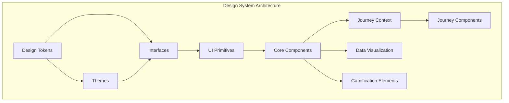

# AUSTA SuperApp Design System Architecture

## 1. Introduction

The AUSTA SuperApp design system provides a unified foundation for building consistent user interfaces across web and mobile platforms. This document outlines the architecture, components, and implementation details of the design system, which serves as the cornerstone for the journey-centered user experience of the AUSTA SuperApp.

The design system is structured to support the three distinct user journeys ("Minha Saúde", "Cuidar-me Agora", and "Meu Plano & Benefícios") while maintaining a cohesive visual language and interaction patterns throughout the application.

## 2. Design System Architecture Overview

The AUSTA SuperApp design system is organized into four discrete workspace packages within the monorepo:

- **@austa/design-system**: The main package that exports all components, themes, and utilities for application consumption. It serves as the public API entry point for all UI components.
- **@design-system/primitives**: Contains all design tokens, atomic UI building blocks, and primitive components that form the foundation of the design system.
- **@austa/interfaces**: Houses all shared TypeScript definitions and type contracts used across the design system and applications.
- **@austa/journey-context**: Provides context providers and hooks for journey-specific state management across components.

This modular approach ensures separation of concerns, promotes reusability, and facilitates maintenance across the platform.

## 3. Layered Architecture

The design system follows a layered architecture that establishes clear separation of concerns and promotes component reusability:

### 3.1 Design Tokens

At the foundation of the design system are design tokens—atomic values that define the visual language authored and versioned in the `@design-system/primitives` package:

- **Colors**: Defines palettes for brand colors, journey-specific themes (health: green, care: orange, plan: blue), semantic states (success, warning, error, info), and a neutral grayscale.
- **Typography**: Specifies font families, sizes, weights, line heights, and letter spacing optimized for bilingual support (Portuguese and English).
- **Spacing**: Implements an 8-point grid system for consistent layout spacing across the application.
- **Shadows**: Provides elevation tokens (sm, md, lg, xl) with precise RGBA values.
- **Animation**: Defines standardized animation durations and easing curves.
- **Breakpoints**: Establishes responsive breakpoints for adapting layouts across device sizes.

### 3.2 Themes

The theming layer applies design tokens consistently across the application with theme contracts enforced by shared types from `@austa/interfaces`:

- **Base Theme**: Consolidates all design tokens into a default theme.
- **Journey-Specific Themes**: 
  - **Health Theme**: Green-based palette with health-specific component styling.
  - **Care Theme**: Orange-based palette with care-specific component styling.
  - **Plan Theme**: Blue-based palette with plan-specific component styling.

### 3.3 Interfaces

The `@austa/interfaces` package hosts all shared TypeScript definitions, ensuring type safety and consistency across the codebase:

- **Theme Interfaces**: Defines the structure of theme objects, ensuring consistent implementation across all themes.
- **Component Props**: Type definitions for all component props, enabling intellisense and type checking.
- **Design Token Types**: TypeScript types for all design tokens, ensuring proper usage in themes and components.
- **Style Types**: Style property interfaces that enforce correct styling options for all components.

### 3.4 UI Primitives

The design system includes five foundational primitives implemented in the standalone `@design-system/primitives` package with its own CI build pipeline:

- **Box**: Provides comprehensive layout capabilities (flex, grid, spacing, sizing, positioning).
- **Text**: Handles typography with support for all text styles, colors, and truncation.
- **Stack**: Implements flex container with responsive spacing and gap support.
- **Icon**: Manages SVG icon rendering with dynamic fills and accessibility.
- **Touchable**: Creates cross-platform pressable elements with consistent interaction states.

### 3.5 Core Components

Built on primitives, the core components in `@austa/design-system` import primitives, tokens, and interfaces from their respective packages:

- **Input Controls**: Button, Input, Select, Checkbox, RadioButton, DatePicker
- **Containers**: Card, Modal, Accordion
- **Feedback**: ProgressBar, ProgressCircle, Toast
- **Navigation**: Tabs, Avatar, Badge

### 3.6 Journey Context

The `@austa/journey-context` package provides React context providers that facilitate state management for journey-specific features:

- **Health Context**: Manages health data, goals, devices, and metrics state.
- **Care Context**: Handles appointment scheduling, medication tracking, and provider information.
- **Plan Context**: Manages insurance benefits, claims status, and coverage details.
- **Cross-Journey State**: Facilitates data sharing between journeys when needed.

### 3.7 Journey Components

Journey-specific components address the unique needs of each user journey, importing components from `@austa/design-system` and context from `@austa/journey-context`:

- **Health**: DeviceCard, GoalCard, HealthChart, MetricCard
- **Care**: AppointmentCard, MedicationCard, ProviderCard, SymptomSelector, VideoConsultation
- **Plan**: BenefitCard, ClaimCard, CoverageInfoCard, InsuranceCard

### 3.8 Data Visualization

Specialized chart components for data visualization:

- **BarChart**: Built on Recharts for showing comparative data.
- **LineChart**: Implemented with Victory for time-series data.
- **RadialChart**: Custom SVG implementation for displaying progress or distribution.

### 3.9 Gamification Elements

Components supporting the gamification system:

- **AchievementBadge**: Displays user achievements with lock/unlock states.
- **Leaderboard**: Shows user rankings with achievement indicators.
- **LevelIndicator**: Visualizes user level and progress.
- **QuestCard**: Presents quests/challenges with progress tracking.
- **RewardCard**: Displays available rewards and XP values.
- **XPCounter**: Shows current XP and remaining points to level up.

## 4. Technology Implementation

The design system is implemented with the following technologies:

- **React/React Native**: Provides cross-platform component architecture.
- **TypeScript**: Ensures type safety and improved developer experience.
- **styled-components**: Implements CSS-in-JS styling with theming support.
- **Accessibility Primitives**: Ensures ARIA compliance and screen reader support.

### 4.1 Monorepo Architecture

- **TypeScript Project References**: Enforces build order and isolated type-checking across the four packages, ensuring proper dependency resolution.
- **Workspace Tooling**: Utilizes pnpm workspaces to orchestrate package installation and linking, enabling consistent versioning across the monorepo.
- **Testing Strategy**: Configures Storybook, visual regression tests, and accessibility tests at the monorepo root level, composed from each design-system package.

### 4.2 Package CI/CD Pipeline

Each design system package follows a standardized CI/CD pipeline:

1. **Linting & Type Check**: Validates code quality and type correctness
2. **Unit Tests**: Verifies component functionality
3. **Build Process**: Compiles TypeScript into JavaScript with proper bundling
4. **Storybook Integration**: Generates component stories for documentation
5. **Visual Regression Testing**: Ensures no unexpected UI changes
6. **Package Publication**: Publishes to the private registry when merged to main branch

## 5. Platform Implementation

The AUSTA SuperApp is implemented on both web and mobile platforms, with each implementation tailored to platform-specific capabilities while maintaining a consistent user experience. Both implementations leverage the monorepo's workspace packages for shared functionality.

### 5.1 Web Frontend Architecture

The web frontend is built with Next.js 13.5.9 and React 18.2.0, providing server-side rendering capabilities for improved performance and SEO.

#### Core Web Components

The web frontend organizes reusable UI components into logical groups, with components importing base primitives from `@design-system/primitives` and shared schemas/types from `@austa/interfaces` instead of local files:

- **Dashboard Components**: AchievementsWidget, AppointmentsWidget, MetricsWidget, RecentActivityWidget
- **Form Components**: AppointmentForm, ClaimForm, HealthGoalForm, HealthMetricForm, ProfileForm
- **Modal Components**: AchievementModal, ConfirmationModal, FilterModal
- **Navigation Components**: Breadcrumbs, JourneyNav, MobileNav, TopBar
- **Shared Components**: EmptyState, ErrorState, GamificationPopup, LoadingIndicator

The project's tsconfig.json at the root defines path aliases for all four internal packages, and Next.js `jsconfig.json` matches these aliases to ensure consistent import resolution.

#### Layout Structure

The web frontend uses a hierarchical layout structure:

- **MainLayout**: The root layout for authenticated users, providing Sidebar (desktop) and TopBar (mobile).
- **Journey-Specific Layouts**: HealthLayout, CareLayout, PlanLayout for journey-specific UI.
- **AuthLayout**: Specialized layout for authentication screens.
- **Context Providers**: All context providers (Auth, Journey, Gamification, Notification) are sourced from `@austa/journey-context`.

### 5.2 Mobile Frontend Architecture

The mobile application is built with React Native 0.71.8 and Expo, providing a native experience on iOS and Android.

#### Mobile Screen Organization

The mobile application organizes screens by journey:

- **Auth Screens**: Login, Register, ForgotPassword, MFA
- **Health Screens**: Dashboard, AddMetric, DeviceConnection, HealthGoals, MedicalHistory, MetricDetail
- **Care Screens**: Dashboard, AppointmentDetail, ProviderSearch, SymptomChecker, Telemedicine, TreatmentPlan
- **Plan Screens**: Dashboard, Benefits, ClaimHistory, ClaimDetail, ClaimSubmission, CostSimulator, Coverage, DigitalCard
- **Home Screens**: Home, Achievements, Notifications, Profile, Settings

The Metro bundler and tsconfig paths have been updated to resolve `@design-system/primitives`, `@austa/interfaces`, and `@austa/journey-context`, ensuring consistent import resolution across the application.

#### Navigation Structure

The mobile app uses React Navigation to manage screen transitions:

- **Stack Navigation**: For hierarchical journey flows.
- **Tab Navigation**: For switching between main app sections.
- **Drawer Navigation**: For accessing settings and profile.

The mobile `package.json` workspace declaration has been updated to reference the new packages and enforce a single React Native version (0.71.8) across all dependencies.

## 6. User Journeys and Screens

The AUSTA SuperApp implements three primary user journeys, each with its own set of screens and interactions.

### 6.1 Authentication Journey

The authentication journey provides user onboarding and account management with screens for Login, Register, Forgot Password, and MFA.

### 6.2 Health Journey ("My Health")

The Health Journey focuses on personal health monitoring and wellness tracking with screens for Health Dashboard, Metric Detail, Add Health Metric, Health Goals, Device Connection, and Medical History.

### 6.3 Care Journey ("Care Now")

The Care Journey focuses on healthcare access and appointment management with screens for Care Dashboard, Appointment Detail, Provider Search, Symptom Checker, Telemedicine, and Treatment Plan.

### 6.4 Plan Journey ("My Plan & Benefits")

The Plan Journey focuses on insurance management and claims with screens for Plan Dashboard, Coverage Details, Digital Insurance Card, Claim History, Claim Detail, Claim Submission, Cost Simulator, and Plan Benefits.

### 6.5 Cross-Journey Features

Several features span multiple journeys, including Home Dashboard, Achievements, Notifications, Profile, and Settings.

## 7. UI/Backend Interaction

The AUSTA SuperApp implements a robust interaction layer between the UI and backend services.

### 7.1 Communication Protocols

The application uses multiple protocols for different interaction needs:

| Protocol | Primary Use Cases | Implementation |
|----------|-------------------|----------------|
| GraphQL | Main data fetching and mutations | Apollo Client |
| REST | File uploads, health checks, specific integrations | Standard fetch API |
| WebSockets | Real-time notifications, telemedicine | Socket.io |

### 7.2 Custom React Hooks

The application abstracts API interactions through custom React hooks that import and return types from the `@austa/interfaces` workspace package for end-to-end type safety.

GraphQL code generation outputs type definitions into the `@austa/interfaces` package, and these hooks consume those generated types to provide strongly-typed API interactions.

| Hook | Purpose | Related Journeys |
|------|---------|------------------|
| useAuth | Authentication operations | All |
| useHealthMetrics | Health data operations | Health |
| useAppointments | Appointment management | Care |
| useClaims | Insurance claim operations | Plan |
| useGamification | Achievement tracking | All |
| useJourney | Journey context management | All |
| useNotifications | Notification handling | All |
| **useJourneyContext** | **Unified journey state management from `@austa/journey-context` package** | **All** |

### 7.3 Form Handling and Validation

The application implements consistent form handling:

- **React Hook Form**: Manages form state and validation
- **Yup/Zod Schemas**: Define validation rules centralized in `@austa/interfaces` and imported into React Hook Form configurations across forms
- **Error Handling**: Consistent field-level and form-level error display with validation error types enforced against shared interfaces rather than ad hoc local schemas
- **Submission Flow**: Loading states, success feedback, and error handling

## 8. Design to Development Workflow

The AUSTA SuperApp follows a structured workflow from design to implementation.

### 8.1 Design Deliverables

Design deliverables include:

- **Design Tokens**: Color, typography, spacing, and other foundational values
- **Component Specifications**: Detailed component behavior and states
- **Screen Designs**: High-fidelity screen designs for all journeys
- **Interactive Prototypes**: User flow demonstrations
- **Design System Documentation**: Comprehensive design guidelines
- **TypeScript Interface Definitions**: Type definitions from `@austa/interfaces` package defining component props, theme structures, and data models
- **Journey Context API Specifications**: Detailed API contracts from `@austa/journey-context` package defining state management interfaces for each journey

### 8.2 Implementation Process

The implementation process follows these steps:

1. **Design Token Implementation**: Converting design tokens to code
2. **Primitive Development**: Building foundational UI primitives
3. **Package Configuration & Publication**: Setting up the monorepo workspace architecture
   - Configuring workspace package.json files for `@austa/design-system`, `@design-system/primitives`, `@austa/interfaces`, and `@austa/journey-context`
   - Implementing semantic versioning strategy with automated version bumping based on change types
   - Registering packages with `pnpm/yarn workspace` for consistent dependency management
   - Establishing CI/CD pipelines for lint, build, and test processes per package
4. **Component Development**: Creating reusable UI components
5. **Component Documentation**: Creating Storybook examples
6. **Journey Integration**: Implementing complete user journeys
7. **Testing and Refinement**: Ensuring quality and consistency

## 9. Conclusion

The AUSTA SuperApp design system architecture provides a robust foundation for building consistent, accessible, and maintainable user interfaces across web and mobile platforms. By organizing the design system into four discrete packages (`@austa/design-system`, `@design-system/primitives`, `@austa/interfaces`, and `@austa/journey-context`), the architecture promotes separation of concerns, facilitates maintenance, and ensures a cohesive user experience across all journeys.

This architecture supports the journey-centered approach of the AUSTA SuperApp, allowing each journey ("Minha Saúde", "Cuidar-me Agora", and "Meu Plano & Benefícios") to maintain its unique identity while sharing common design patterns and components. The layered approach—from design tokens to journey-specific components—ensures consistency and scalability as the application evolves.

By following this architecture, developers can efficiently build and maintain the AUSTA SuperApp, ensuring a high-quality user experience across all platforms and journeys.