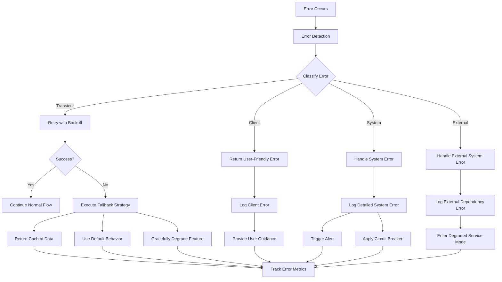

# AUSTA SuperApp Error Handling Framework

## Table of Contents

1. [Introduction](#introduction)
2. [Error Classification System](#error-classification-system)
3. [Error Detection Techniques](#error-detection-techniques)
4. [Recovery Strategies](#recovery-strategies)
   - [Retry with Exponential Backoff](#retry-with-exponential-backoff)
   - [Circuit Breaker Pattern](#circuit-breaker-pattern)
   - [Fallback Strategies](#fallback-strategies)
5. [Error Reporting and Logging](#error-reporting-and-logging)
6. [Client-Friendly Error Responses](#client-friendly-error-responses)
7. [Journey-Specific Error Handling](#journey-specific-error-handling)
8. [NestJS Integration](#nestjs-integration)
9. [Best Practices](#best-practices)
10. [Examples](#examples)

## Introduction

The AUSTA SuperApp implements a comprehensive error handling framework to ensure consistent error detection, classification, recovery, and reporting across all services. This document outlines the standardized approach to error handling that improves system reliability, enhances user experience, and facilitates troubleshooting.



## Error Classification System

The AUSTA SuperApp classifies errors into four primary categories, with journey-specific subcategories for more granular handling:

### Primary Error Types

1. **Client Errors (4xx)**
   - **Validation Errors**: Invalid input, format errors, constraint violations
   - **Business Logic Errors**: Resource not found, business rule violations, state conflicts
   - **Authentication/Authorization Errors**: Invalid credentials, insufficient permissions

2. **System Errors (5xx)**
   - **Technical Errors**: Internal server errors, database failures, unexpected exceptions
   - **Configuration Errors**: Missing environment variables, invalid configuration
   - **Resource Errors**: Memory limits, CPU constraints, disk space issues

3. **Transient Errors**
   - **Network Timeouts**: Temporary connectivity issues
   - **Rate Limiting**: Throttling from external services
   - **Temporary Unavailability**: Brief service disruptions
   - **Concurrency Issues**: Race conditions, deadlocks

4. **External Dependency Errors**
   - **API Failures**: External service errors
   - **Integration Errors**: Format mismatches, protocol issues
   - **Authentication Failures**: Expired tokens, invalid credentials
   - **Availability Issues**: External service outages

### Journey-Specific Error Classification

Each journey (Health, Care, Plan) has specialized error types that extend the primary categories:

#### Health Journey

- **Metrics Errors**: Invalid health data, threshold violations
- **Goals Errors**: Invalid goal parameters, conflicting goals
- **Insights Errors**: Insufficient data, analysis failures
- **Devices Errors**: Connection failures, synchronization issues
- **FHIR Errors**: Resource validation, endpoint failures

#### Care Journey

- **Appointment Errors**: Scheduling conflicts, provider unavailability
- **Provider Errors**: Credential issues, specialty mismatches
- **Telemedicine Errors**: Connection failures, device compatibility
- **Medication Errors**: Dosage issues, interaction warnings
- **Symptom Errors**: Assessment failures, diagnosis engine errors
- **Treatment Errors**: Plan conflicts, progress tracking issues

#### Plan Journey

- **Plans Errors**: Selection validation, availability issues
- **Benefits Errors**: Eligibility issues, limit exceeded
- **Coverage Errors**: Service not covered, network restrictions
- **Claims Errors**: Submission validation, processing failures
- **Documents Errors**: Format issues, verification failures

## Error Detection Techniques

The AUSTA SuperApp employs multiple techniques to detect errors across all services:

### Input Validation

- **API Gateway Validation**: Request schema validation using JSON Schema
- **Service-Level Validation**: Domain-specific validation using class-validator
- **Custom Validators**: Journey-specific validation rules

```typescript
// Example of input validation with class-validator
import { IsString, IsEmail, MinLength, ValidateNested } from 'class-validator';
import { Type } from 'class-transformer';

export class CreateUserDto {
  @IsString()
  @MinLength(2)
  name: string;

  @IsEmail()
  email: string;

  @ValidateNested()
  @Type(() => AddressDto)
  address: AddressDto;
}
```

### Exception Handling

- **Try-Catch Blocks**: Strategic placement in critical sections
- **Async/Await Error Handling**: Proper handling of Promise rejections
- **Global Exception Filter**: Catches unhandled exceptions

```typescript
// Example of proper async/await error handling
async function fetchUserData(userId: string) {
  try {
    const response = await userService.findById(userId);
    return response.data;
  } catch (error) {
    // Rethrow as a domain-specific error with context
    if (error.status === 404) {
      throw new UserNotFoundError(userId);
    }
    throw new UserServiceError('Failed to fetch user data', { userId, cause: error });
  }
}
```

### Health Checks

- **Service Liveness**: Verifies service is running
- **Service Readiness**: Confirms service can handle requests
- **Dependency Checks**: Validates external service availability

```typescript
// Example of a health check endpoint
@Controller('health')
export class HealthController {
  constructor(private healthService: HealthService) {}

  @Get()
  async check() {
    return {
      status: 'UP',
      checks: [
        {
          name: 'database',
          status: await this.healthService.checkDatabase(),
        },
        {
          name: 'redis',
          status: await this.healthService.checkRedis(),
        },
        {
          name: 'external-api',
          status: await this.healthService.checkExternalApi(),
        },
      ],
    };
  }
}
```

### Timeout Detection

- **Request Timeouts**: HTTP request timeout monitoring
- **Operation Timeouts**: Database query and operation timeouts
- **Integration Timeouts**: External API call timeouts

```typescript
// Example of timeout handling with Axios
import axios from 'axios';
import { TimeoutError } from '@austa/errors';

async function callExternalApi() {
  try {
    return await axios.get('https://api.example.com/data', {
      timeout: 5000, // 5 seconds
    });
  } catch (error) {
    if (error.code === 'ECONNABORTED') {
      throw new TimeoutError('External API request timed out', {
        resource: 'api.example.com',
        operation: 'getData',
        timeout: 5000,
      });
    }
    throw error;
  }
}
```

### Monitoring and Alerting

- **Error Rate Monitoring**: Tracks error frequency by type
- **Latency Monitoring**: Identifies slow operations
- **Dependency Health**: Monitors external service health
- **Threshold Alerts**: Triggers notifications when error rates exceed thresholds

## Recovery Strategies

The AUSTA SuperApp implements several recovery strategies to handle different error scenarios:

### Retry with Exponential Backoff

For transient errors, the system employs retry with exponential backoff to automatically recover from temporary failures:

```typescript
// Example using the retry utility
import { retryWithBackoff } from '@austa/errors/utils';

async function fetchDataWithRetry() {
  return retryWithBackoff(
    async () => externalApiClient.getData(),
    {
      maxAttempts: 5,
      initialDelayMs: 100,
      maxDelayMs: 5000,
      backoffFactor: 2,
      shouldRetry: (error) => error.isTransient || error.status >= 500,
    }
  );
}
```

The retry mechanism includes:

- **Configurable Attempts**: Customizable maximum retry attempts
- **Exponential Delay**: Increasing wait time between retries
- **Jitter**: Random variation to prevent thundering herd problem
- **Conditional Retry**: Only retry for specific error types
- **Timeout**: Maximum total time for all retry attempts

### Circuit Breaker Pattern

To prevent cascading failures when external dependencies are unavailable, the system implements the circuit breaker pattern:

```typescript
// Example using the CircuitBreaker utility
import { CircuitBreaker } from '@austa/errors/utils';

const apiCircuitBreaker = new CircuitBreaker({
  failureThreshold: 5,      // Number of failures before opening
  resetTimeout: 30000,      // Time before attempting reset (30 seconds)
  monitorInterval: 5000,    // Health check interval when half-open
  timeout: 10000,           // Operation timeout
  fallback: () => ({ data: cachedData, source: 'cache' }),
});

async function getExternalData() {
  return apiCircuitBreaker.execute(() => externalApiClient.getData());
}
```

The circuit breaker operates in three states:

1. **Closed**: Normal operation, calls pass through
2. **Open**: After failure threshold reached, calls fail fast
3. **Half-Open**: After reset timeout, allows test calls to check recovery

### Fallback Strategies

When operations fail despite retries, the system employs fallback strategies:

1. **Cached Data**: Return previously cached results
   ```typescript
   async function getUserProfile(userId: string) {
     try {
       const profile = await userService.getProfile(userId);
       cache.set(`user:${userId}:profile`, profile, { ttl: 3600 });
       return profile;
     } catch (error) {
       const cachedProfile = cache.get(`user:${userId}:profile`);
       if (cachedProfile) {
         return { ...cachedProfile, fromCache: true };
       }
       throw error;
     }
   }
   ```

2. **Default Behavior**: Use safe default values
   ```typescript
   async function getRecommendations(userId: string) {
     try {
       return await recommendationService.getPersonalized(userId);
     } catch (error) {
       logger.warn('Failed to get personalized recommendations, using defaults', { userId, error });
       return recommendationService.getDefaultRecommendations();
     }
   }
   ```

3. **Graceful Degradation**: Disable non-critical features
   ```typescript
   async function loadDashboard() {
     const results = await Promise.allSettled([
       userService.getProfile(),
       metricsService.getRecentMetrics(),
       goalsService.getActiveGoals(),
       insightsService.getPersonalizedInsights(),
     ]);
     
     // Return partial data even if some requests failed
     return {
       profile: results[0].status === 'fulfilled' ? results[0].value : null,
       metrics: results[1].status === 'fulfilled' ? results[1].value : [],
       goals: results[2].status === 'fulfilled' ? results[2].value : [],
       insights: results[3].status === 'fulfilled' ? results[3].value : [],
     };
   }
   ```

## Error Reporting and Logging

The AUSTA SuperApp implements comprehensive error reporting and logging to facilitate troubleshooting and monitoring:

### Structured Error Logging

All errors are logged with structured data including:

- **Error Type**: Classification of the error
- **Error Code**: Unique identifier for the error
- **Message**: Human-readable error description
- **Stack Trace**: For technical errors in non-production environments
- **Context**: Request ID, user ID, journey context
- **Metadata**: Additional error-specific information

```typescript
// Example of structured error logging
import { Logger } from '@austa/logging';

const logger = new Logger('UserService');

try {
  // Operation that might fail
} catch (error) {
  logger.error('Failed to process user request', {
    errorType: error.type,
    errorCode: error.code,
    userId: request.user?.id,
    requestId: request.id,
    journey: 'Health',
    operation: 'updateHealthMetrics',
    metadata: error.metadata,
  });
  throw error;
}
```

### Distributed Tracing

Errors are correlated across services using distributed tracing:

- **Trace ID**: Unique identifier for the request across services
- **Span ID**: Identifier for specific operation within the trace
- **Error Tagging**: Marks spans containing errors
- **Error Context**: Adds error details to the span

```typescript
// Example of error handling with distributed tracing
import { Tracer } from '@austa/tracing';

const tracer = Tracer.getTracer('health-service');

async function processHealthData(data) {
  return tracer.startActiveSpan('processHealthData', async (span) => {
    try {
      span.setAttributes({
        'data.size': data.length,
        'data.type': data.type,
      });
      
      const result = await healthProcessor.process(data);
      return result;
    } catch (error) {
      span.setStatus({ code: SpanStatusCode.ERROR });
      span.recordException(error);
      throw error;
    } finally {
      span.end();
    }
  });
}
```

### Error Aggregation

Errors are aggregated and analyzed to identify patterns:

- **Error Frequency**: Tracks occurrence rates
- **Error Distribution**: Analyzes errors by service, endpoint, and user
- **Error Correlation**: Identifies related errors across services
- **Trend Analysis**: Monitors changes in error patterns over time

### Alerting

Critical errors trigger alerts through multiple channels:

- **Immediate Alerts**: For high-severity errors affecting multiple users
- **Threshold Alerts**: When error rates exceed defined thresholds
- **Escalation**: Tiered alerting based on error persistence
- **On-Call Rotation**: Alerts routed to on-call personnel

## Client-Friendly Error Responses

The AUSTA SuperApp provides consistent, user-friendly error responses across all services:

### Error Response Format

All API error responses follow a standardized format:

```json
{
  "error": {
    "code": "HEALTH_METRICS_VALIDATION_001",
    "message": "The blood pressure reading is outside the valid range.",
    "details": [
      {
        "field": "systolic",
        "message": "Systolic pressure must be between 70 and 250 mmHg.",
        "value": 260
      }
    ],
    "type": "validation",
    "timestamp": "2023-06-15T14:22:31.456Z",
    "requestId": "f8c3de3d-1a2b-4c5d-8e7f-9g0h1i2j3k4l",
    "journey": "Health",
    "help": "https://support.austa.health/error/HEALTH_METRICS_VALIDATION_001"
  }
}
```

### Journey Context in Error Messages

Error messages include journey-specific context to help users understand and resolve issues:

```typescript
// Example of journey-specific error message generation
import { formatErrorWithContext } from '@austa/errors/utils';

const errorMessage = formatErrorWithContext(
  'appointment-booking-failed',
  {
    providerName: 'Dr. Smith',
    appointmentDate: '2023-06-20',
    appointmentTime: '14:30',
    reason: 'provider-unavailable',
  },
  'Care'
);

// Results in: "Unable to book appointment with Dr. Smith on June 20 at 2:30 PM 
// because the provider is unavailable at that time. Please select a different 
// time or provider."
```

### Localized Error Messages

Error messages are localized based on user preferences:

```typescript
// Example of localized error message generation
import { i18n } from '@austa/i18n';

function getLocalizedErrorMessage(error, locale = 'en') {
  return i18n.t(`errors.${error.code}`, {
    lng: locale,
    defaultValue: error.message,
    ...error.context,
  });
}
```

### Recovery Suggestions

Error responses include actionable suggestions when possible:

```json
{
  "error": {
    "code": "CARE_APPOINTMENT_CONFLICT_002",
    "message": "This appointment time conflicts with your existing appointment.",
    "type": "business",
    "timestamp": "2023-06-15T14:22:31.456Z",
    "requestId": "f8c3de3d-1a2b-4c5d-8e7f-9g0h1i2j3k4l",
    "journey": "Care",
    "suggestions": [
      {
        "action": "reschedule",
        "description": "Reschedule your existing appointment",
        "link": "/care/appointments/reschedule/123"
      },
      {
        "action": "select-different-time",
        "description": "Select a different time for this appointment",
        "availableTimes": ["15:30", "16:00", "16:30"]
      }
    ]
  }
}
```

## Journey-Specific Error Handling

Each journey in the AUSTA SuperApp has specialized error handling tailored to its domain:

### Health Journey

The Health journey implements specialized error handling for health data, devices, and insights:

```typescript
// Example of Health journey-specific error
import { Health } from '@austa/errors/journey';

try {
  await healthMetricsService.recordBloodPressure(userId, { systolic: 260, diastolic: 85 });
} catch (error) {
  if (error instanceof Health.Metrics.InvalidMetricValueError) {
    // Handle invalid health metric specifically
    notifyUser({
      type: 'warning',
      title: 'Unusual Blood Pressure Reading',
      message: 'The blood pressure reading you entered appears to be outside the normal range. Please verify your measurement or consult a healthcare provider if this reading is accurate.',
      journey: 'Health',
    });
    throw error;
  }
  // Handle other errors
}
```

### Care Journey

The Care journey implements specialized error handling for appointments, providers, and telemedicine:

```typescript
// Example of Care journey-specific error
import { Care } from '@austa/errors/journey';

try {
  await appointmentService.scheduleAppointment(appointmentData);
} catch (error) {
  if (error instanceof Care.Appointment.AppointmentOverlapError) {
    // Handle appointment conflict specifically
    const alternativeTimes = await appointmentService.getSuggestedTimes({
      providerId: appointmentData.providerId,
      date: appointmentData.date,
      duration: appointmentData.duration,
    });
    
    return {
      success: false,
      error: error.message,
      alternativeTimes,
      conflictingAppointment: error.metadata.conflictingAppointment,
    };
  }
  // Handle other errors
}
```

### Plan Journey

The Plan journey implements specialized error handling for benefits, claims, and coverage:

```typescript
// Example of Plan journey-specific error
import { Plan } from '@austa/errors/journey';

try {
  await claimsService.submitClaim(claimData);
} catch (error) {
  if (error instanceof Plan.Claims.ClaimValidationError) {
    // Handle claim validation specifically
    return {
      success: false,
      validationErrors: error.metadata.validationErrors,
      missingDocuments: error.metadata.missingDocuments,
      suggestedCorrections: error.metadata.suggestedCorrections,
    };
  } else if (error instanceof Plan.Coverage.ServiceNotCoveredError) {
    // Handle coverage issue specifically
    return {
      success: false,
      error: error.message,
      coverageDetails: error.metadata.coverageDetails,
      alternativeServices: await planService.findAlternativeCoveredServices(claimData.serviceCode),
    };
  }
  // Handle other errors
}
```

## NestJS Integration

The AUSTA SuperApp integrates the error handling framework with NestJS through filters, interceptors, and decorators:

### Global Exception Filter

The GlobalExceptionFilter captures all unhandled exceptions and transforms them into standardized responses:

```typescript
// Example of registering the global exception filter
import { GlobalExceptionFilter } from '@austa/errors/nest';

@Module({
  providers: [
    {
      provide: APP_FILTER,
      useClass: GlobalExceptionFilter,
    },
  ],
})
export class AppModule {}
```

### Error Interceptors

Interceptors provide advanced error handling capabilities:

```typescript
// Example of using error interceptors
import { RetryInterceptor, CircuitBreakerInterceptor } from '@austa/errors/nest';

@UseInterceptors(RetryInterceptor)
@UseInterceptors(CircuitBreakerInterceptor)
@Controller('health-metrics')
export class HealthMetricsController {
  // Controller methods
}
```

### Error Decorators

Decorators provide declarative error handling configuration:

```typescript
// Example of using error decorators
import { Retry, CircuitBreaker, Fallback } from '@austa/errors/nest';

@Controller('appointments')
export class AppointmentsController {
  constructor(private appointmentsService: AppointmentsService) {}

  @Post()
  @Retry({ maxAttempts: 3, delay: 1000 })
  @CircuitBreaker({ failureThreshold: 5, resetTimeout: 30000 })
  @Fallback(fallbackAppointmentCreation)
  async createAppointment(@Body() appointmentData: CreateAppointmentDto) {
    return this.appointmentsService.create(appointmentData);
  }

  // Fallback method
  async fallbackAppointmentCreation(appointmentData: CreateAppointmentDto, error: Error) {
    // Log the error
    this.logger.warn('Appointment creation failed, using fallback', { error });
    
    // Store appointment request for later processing
    await this.appointmentsService.queueForRetry(appointmentData);
    
    // Return response to user
    return {
      status: 'pending',
      message: 'Your appointment request has been received and will be processed shortly.',
      referenceId: generateReferenceId(),
    };
  }
}
```

### ErrorsModule

The ErrorsModule provides centralized configuration for the error handling framework:

```typescript
// Example of configuring the ErrorsModule
import { ErrorsModule } from '@austa/errors/nest';

@Module({
  imports: [
    ErrorsModule.forRoot({
      // Global configuration
      logErrors: true,
      exposeErrors: process.env.NODE_ENV !== 'production',
      trackErrorMetrics: true,
      
      // Default retry configuration
      retry: {
        maxAttempts: 3,
        initialDelayMs: 100,
        maxDelayMs: 2000,
        backoffFactor: 2,
      },
      
      // Default circuit breaker configuration
      circuitBreaker: {
        failureThreshold: 5,
        resetTimeout: 30000,
        monitorInterval: 5000,
      },
    }),
  ],
})
export class AppModule {}
```

## Best Practices

Follow these best practices for consistent error handling across the AUSTA SuperApp:

### Error Creation

1. **Use Specific Error Classes**: Create and throw the most specific error class available
   ```typescript
   // Bad
   throw new Error('User not found');
   
   // Good
   throw new UserNotFoundError(userId);
   ```

2. **Include Context**: Always provide relevant context with errors
   ```typescript
   // Bad
   throw new InvalidParameterError('Invalid age');
   
   // Good
   throw new InvalidParameterError('Age must be between 0 and 120', {
     field: 'age',
     value: age,
     constraint: '0-120',
   });
   ```

3. **Preserve Cause Chain**: Maintain the original error as the cause
   ```typescript
   // Bad
   try {
     await db.query(sql);
   } catch (error) {
     throw new DatabaseError('Query failed');
   }
   
   // Good
   try {
     await db.query(sql);
   } catch (error) {
     throw new DatabaseError('Query failed', { cause: error, query: sql });
   }
   ```

### Error Handling

1. **Catch at Boundaries**: Handle errors at service boundaries
   ```typescript
   // Controller level error handling
   @Post()
   async createUser(@Body() userData: CreateUserDto) {
     try {
       return await this.userService.create(userData);
     } catch (error) {
       // Transform domain errors to appropriate HTTP responses
       if (error instanceof UserExistsError) {
         throw new ConflictException(error.message);
       }
       throw error; // Let the global filter handle other errors
     }
   }
   ```

2. **Don't Swallow Errors**: Always log or rethrow errors
   ```typescript
   // Bad
   try {
     await riskyOperation();
   } catch (error) {
     // Error swallowed
   }
   
   // Good
   try {
     await riskyOperation();
   } catch (error) {
     logger.error('Risky operation failed', { error });
     throw error;
   }
   ```

3. **Use Async/Await Properly**: Handle Promise rejections correctly
   ```typescript
   // Bad
   function processData() {
     fetchData().then(data => {
       // Process data
     }); // Unhandled rejection
   }
   
   // Good
   async function processData() {
     try {
       const data = await fetchData();
       // Process data
     } catch (error) {
       // Handle error
     }
   }
   ```

### Recovery

1. **Implement Graceful Degradation**: Maintain core functionality when possible
   ```typescript
   async function loadDashboard() {
     const [profileResult, metricsResult] = await Promise.allSettled([
       userService.getProfile(),
       metricsService.getRecentMetrics(),
     ]);
     
     return {
       profile: profileResult.status === 'fulfilled' ? profileResult.value : null,
       metrics: metricsResult.status === 'fulfilled' ? metricsResult.value : [],
       // Include error information for failed components
       errors: {
         profile: profileResult.status === 'rejected' ? profileResult.reason.message : null,
         metrics: metricsResult.status === 'rejected' ? metricsResult.reason.message : null,
       },
     };
   }
   ```

2. **Use Circuit Breakers for External Dependencies**: Prevent cascading failures
   ```typescript
   const externalApiClient = createCircuitBreakerClient({
     baseURL: 'https://api.external-service.com',
     timeout: 5000,
     circuitBreaker: {
       failureThreshold: 5,
       resetTimeout: 30000,
     },
   });
   ```

3. **Implement Retry for Transient Errors**: Recover automatically when possible
   ```typescript
   const retryableOperation = retryWithBackoff(
     async () => externalApiClient.getData(),
     {
       maxAttempts: 3,
       shouldRetry: (error) => isTransientError(error),
     }
   );
   ```

## Examples

### Complete Error Handling Example

```typescript
import { Controller, Post, Body, UseInterceptors } from '@nestjs/common';
import { RetryInterceptor, CircuitBreakerInterceptor } from '@austa/errors/nest';
import { Logger } from '@austa/logging';
import { Tracer } from '@austa/tracing';
import { Health } from '@austa/errors/journey';
import { retryWithBackoff, CircuitBreaker } from '@austa/errors/utils';

@Controller('health/metrics')
@UseInterceptors(CircuitBreakerInterceptor)
export class HealthMetricsController {
  private readonly logger = new Logger(HealthMetricsController.name);
  private readonly tracer = Tracer.getTracer('health-service');
  private readonly deviceApiCircuitBreaker = new CircuitBreaker({
    failureThreshold: 3,
    resetTimeout: 30000,
  });

  constructor(private metricsService: HealthMetricsService) {}

  @Post('sync')
  @UseInterceptors(RetryInterceptor)
  async syncMetricsFromDevice(@Body() syncRequest: SyncMetricsDto) {
    return this.tracer.startActiveSpan('syncMetricsFromDevice', async (span) => {
      try {
        span.setAttributes({
          'userId': syncRequest.userId,
          'deviceId': syncRequest.deviceId,
          'deviceType': syncRequest.deviceType,
        });

        // Validate the sync request
        if (!syncRequest.deviceId) {
          throw new Health.Devices.DeviceIdRequiredError();
        }

        // Connect to device API with circuit breaker
        const deviceData = await this.deviceApiCircuitBreaker.execute(
          () => this.fetchDeviceData(syncRequest)
        );

        // Process metrics with retry for transient errors
        const processedMetrics = await retryWithBackoff(
          () => this.metricsService.processMetrics(deviceData),
          {
            maxAttempts: 3,
            initialDelayMs: 200,
            shouldRetry: (error) => {
              return error instanceof Health.Metrics.MetricProcessingError && 
                     error.isTransient;
            },
          }
        );

        // Log success
        this.logger.info('Successfully synced metrics from device', {
          userId: syncRequest.userId,
          deviceId: syncRequest.deviceId,
          metricCount: processedMetrics.length,
        });

        return {
          success: true,
          syncedAt: new Date().toISOString(),
          metrics: processedMetrics,
        };
      } catch (error) {
        // Handle specific error types
        if (error instanceof Health.Devices.DeviceConnectionFailureError) {
          span.setStatus({ code: SpanStatusCode.ERROR });
          span.recordException(error);
          
          this.logger.warn('Failed to connect to device', {
            userId: syncRequest.userId,
            deviceId: syncRequest.deviceId,
            error: error.message,
          });
          
          // Return user-friendly error with troubleshooting steps
          return {
            success: false,
            error: {
              code: error.code,
              message: 'Unable to connect to your device. Please ensure your device is powered on and within range.',
              troubleshooting: [
                'Check that Bluetooth is enabled on your phone',
                'Ensure your device is charged and powered on',
                'Try moving your device closer to your phone',
                'Restart your device and try again',
              ],
            },
          };
        }
        
        if (error instanceof Health.Metrics.InvalidMetricValueError) {
          span.setStatus({ code: SpanStatusCode.ERROR });
          span.recordException(error);
          
          this.logger.warn('Invalid metric data received from device', {
            userId: syncRequest.userId,
            deviceId: syncRequest.deviceId,
            metricType: error.metadata.metricType,
            value: error.metadata.value,
            error: error.message,
          });
          
          return {
            success: false,
            error: {
              code: error.code,
              message: 'Some measurements from your device appear to be invalid and were not saved.',
              invalidMetrics: error.metadata.invalidMetrics,
            },
            partialSuccess: error.metadata.validMetrics.length > 0,
            validMetrics: error.metadata.validMetrics,
          };
        }
        
        // For unexpected errors, log and rethrow
        span.setStatus({ code: SpanStatusCode.ERROR });
        span.recordException(error);
        
        this.logger.error('Unexpected error during device sync', {
          userId: syncRequest.userId,
          deviceId: syncRequest.deviceId,
          error,
        });
        
        throw error;
      } finally {
        span.end();
      }
    });
  }

  private async fetchDeviceData(syncRequest: SyncMetricsDto) {
    try {
      return await this.metricsService.fetchFromDevice(
        syncRequest.deviceId,
        syncRequest.deviceType,
        syncRequest.lastSyncDate
      );
    } catch (error) {
      // Transform generic errors to domain-specific errors
      if (error.code === 'ECONNREFUSED' || error.code === 'ETIMEDOUT') {
        throw new Health.Devices.DeviceConnectionFailureError(syncRequest.deviceId, {
          cause: error,
          deviceType: syncRequest.deviceType,
          lastSyncDate: syncRequest.lastSyncDate,
        });
      }
      throw error;
    }
  }
}
```

### Error Boundary Component (React)

```tsx
import React, { Component, ErrorInfo, ReactNode } from 'react';
import { ErrorDisplay } from '@austa/design-system';
import { logError } from '@austa/logging';

interface ErrorBoundaryProps {
  children: ReactNode;
  fallback?: ReactNode;
  journey?: 'Health' | 'Care' | 'Plan';
  onError?: (error: Error, errorInfo: ErrorInfo) => void;
}

interface ErrorBoundaryState {
  hasError: boolean;
  error: Error | null;
}

export class ErrorBoundary extends Component<ErrorBoundaryProps, ErrorBoundaryState> {
  constructor(props: ErrorBoundaryProps) {
    super(props);
    this.state = { hasError: false, error: null };
  }

  static getDerivedStateFromError(error: Error) {
    return { hasError: true, error };
  }

  componentDidCatch(error: Error, errorInfo: ErrorInfo) {
    // Log the error
    logError('React component error', {
      error,
      componentStack: errorInfo.componentStack,
      journey: this.props.journey,
    });

    // Call the onError callback if provided
    if (this.props.onError) {
      this.props.onError(error, errorInfo);
    }
  }

  render() {
    if (this.state.hasError) {
      // Render custom fallback UI if provided
      if (this.props.fallback) {
        return this.props.fallback;
      }

      // Render default error display
      return (
        <ErrorDisplay
          error={this.state.error}
          journey={this.props.journey}
          onRetry={() => this.setState({ hasError: false, error: null })}
        />
      );
    }

    return this.props.children;
  }
}
```

### Error Handling in React Query

```tsx
import { useQuery, useMutation, QueryClient } from 'react-query';
import { formatErrorWithContext } from '@austa/errors/utils';
import { useToast } from '@austa/design-system';

// Configure global error handling
const queryClient = new QueryClient({
  defaultOptions: {
    queries: {
      retry: (failureCount, error: any) => {
        // Don't retry on 4xx errors
        if (error.status >= 400 && error.status < 500) {
          return false;
        }
        // Retry up to 3 times on other errors
        return failureCount < 3;
      },
      onError: (error: any) => {
        // Global error logging
        console.error('Query error:', error);
      },
    },
    mutations: {
      onError: (error: any) => {
        // Global error logging
        console.error('Mutation error:', error);
      },
    },
  },
});

// Component with error handling
function AppointmentBooking() {
  const toast = useToast();
  
  // Query with error handling
  const { data: providers, error: providersError, isLoading } = useQuery(
    ['providers'],
    () => fetchProviders(),
    {
      onError: (error: any) => {
        toast({
          title: 'Error loading providers',
          description: formatErrorWithContext(
            'providers-load-failed',
            { reason: error.message },
            'Care'
          ),
          status: 'error',
        });
      },
    }
  );
  
  // Mutation with error handling
  const { mutate: bookAppointment, isLoading: isBooking } = useMutation(
    (appointmentData) => createAppointment(appointmentData),
    {
      onSuccess: () => {
        toast({
          title: 'Appointment Booked',
          description: 'Your appointment has been successfully scheduled.',
          status: 'success',
        });
        queryClient.invalidateQueries(['appointments']);
      },
      onError: (error: any) => {
        // Handle specific error types
        if (error.code === 'CARE_APPOINTMENT_CONFLICT_002') {
          toast({
            title: 'Scheduling Conflict',
            description: formatErrorWithContext(
              'appointment-conflict',
              {
                existingAppointment: error.metadata.conflictingAppointment,
                requestedTime: error.metadata.requestedTime,
              },
              'Care'
            ),
            status: 'warning',
            actions: [
              {
                label: 'View Conflicts',
                onClick: () => navigateToAppointments(),
              },
              {
                label: 'Try Different Time',
                onClick: () => setShowTimePicker(true),
              },
            ],
          });
        } else {
          toast({
            title: 'Booking Failed',
            description: error.message,
            status: 'error',
          });
        }
      },
    }
  );
  
  // Component rendering
  if (isLoading) return <Loading />;
  if (providersError) return <ErrorState error={providersError} />;
  
  return (
    <AppointmentForm 
      providers={providers} 
      onSubmit={bookAppointment} 
      isSubmitting={isBooking} 
    />
  );
}
```